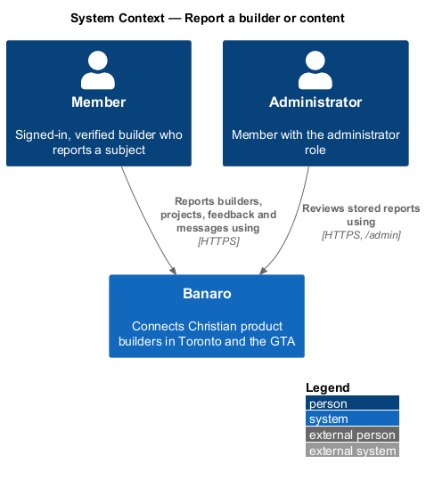
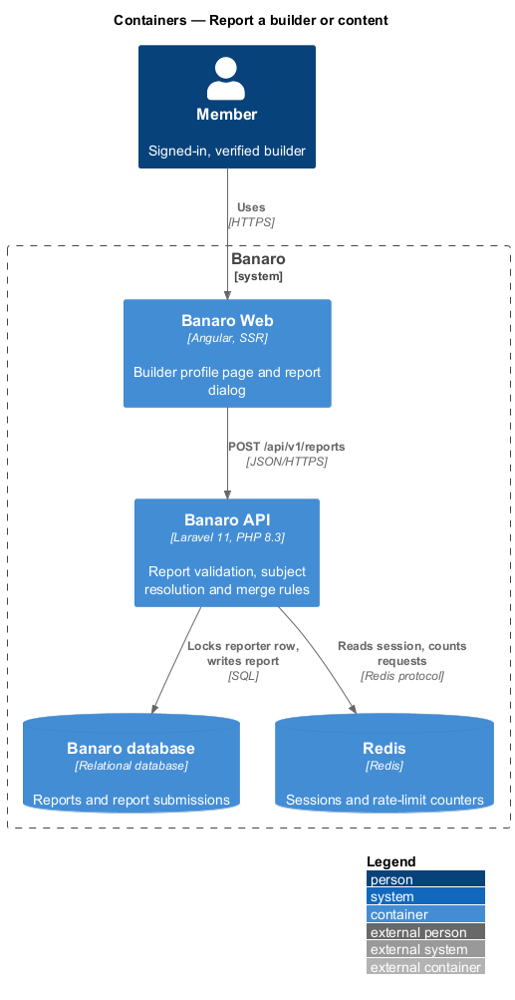
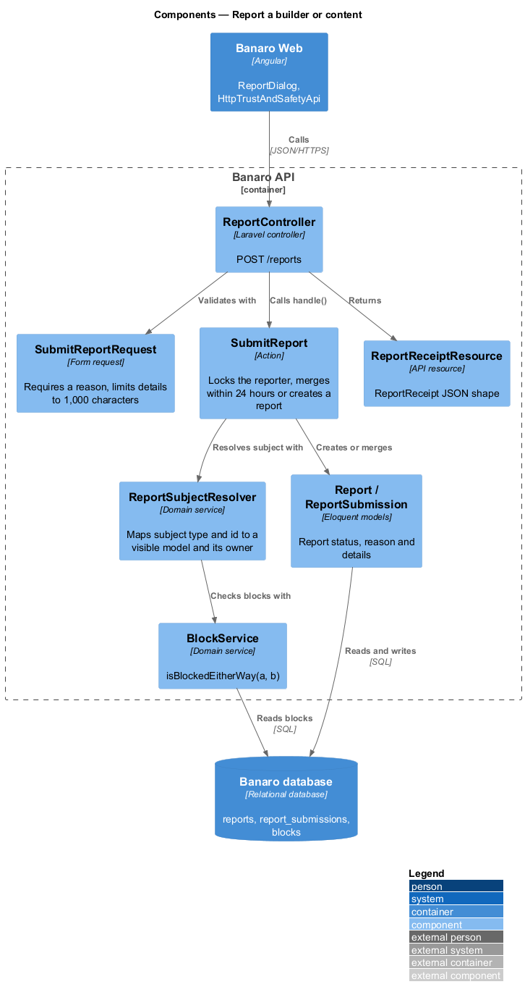
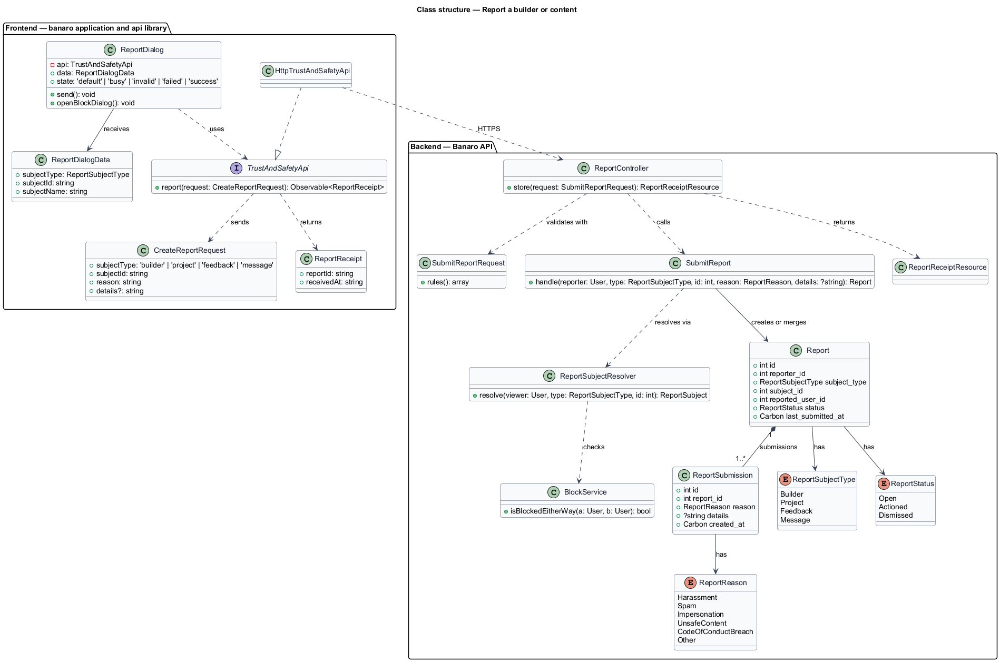
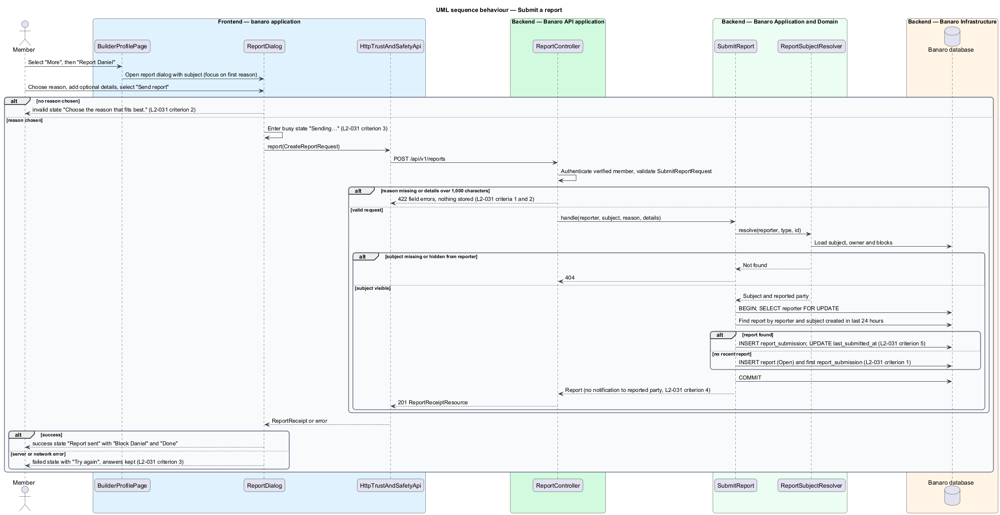

# Report a builder or content

## Overview

Banaro is a faith-aligned community, and its code of conduct sets how members treat each other. This
feature lets a member tell the administrators that a builder, a project, a feedback item or a message
breaks that code. It belongs to the `trust-and-safety` subsystem. The `moderate-reports` feature
describes how administrators review and act on what this feature stores.

Terms used in this design:

- **report** — member's stored complaint about one subject, with a reason and optional details
- **reporter** — member who submits a report
- **subject** — builder, project, feedback item or message that a report concerns
- **reported party** — member who owns the subject; for a builder subject, the builder
- **reason** — one value from the closed list of report reasons in `L2-031` criterion 1
- **submission** — one sending of the `report` dialog; a report holds one or more submissions
- **merge** — attachment of a second submission to an existing report instead of a new report

A member opens the `report` dialog from the "More" menu on a builder profile ("Report Daniel"). The
member picks one reason, may add details and selects "Send report". The API stores the report for
administrators and never tells the reported party who reported them. When the same member reports the
same subject again within 24 hours, the API merges the second submission into the first report. The
success state then offers to block the builder through the `block-builder` feature.

## Description

The slice runs from the `report` dialog in Banaro Web through the Banaro API to the Banaro database.
No e-mail leaves Banaro for a report, so the Banaro Worker takes no part.

### Frontend — `banaro` application and libraries

- **`ReportDialog`** (`dialogs/report/`) — CDK dialog with the `default`, `busy`, `invalid`, `failed`
  and `success` states of the mock. It receives a `ReportDialogData` value with `subjectType`,
  `subjectId` and `subjectName`. It renders the reasons as one radio group and the details as a text
  area with a 1,000-character counter.
  - Without a reason, "Send report" shows the `invalid` state ("Choose the reason that fits best.")
    and moves focus to the first reason. It sends no request (`L2-031` criterion 2).
  - While sending, the button reads "Sending…" and a second send is blocked. "Cancel" stays enabled
    and closes the dialog; the request in flight still completes (`L2-031` criterion 3).
  - On failure, the `failed` state shows a danger alert that never auto-dismisses. It keeps the chosen
    reason and details and offers "Try again" (`L2-031` criterion 3).
  - On success, the `success` state ("Report sent") moves focus to its heading. For a builder subject
    it offers "Block Daniel", which closes this dialog and opens `BlockBuilderDialog`.
- **`BuilderProfilePage`** (`pages/builder-profile/`) — opens `ReportDialog` from its "More" menu.
  Escape returns focus to the "More" button. The `view-builder-profile` feature owns the page.
- **`TrustAndSafetyApi`** / **`TRUST_AND_SAFETY_API`** / **`HttpTrustAndSafetyApi`** (`api` library) —
  the contract, its injection token and its HTTP implementation. `report(request)` sends
  `POST /api/v1/reports` and returns a `ReportReceipt`.
- **`CreateReportRequest`** (`api` library model) — `subjectType` (`builder`, `project`, `feedback` or
  `message`), `subjectId`, `reason` and optional `details`.
- **`ReportReceipt`** (`api` library model) — `reportId` and `receivedAt`. It carries no field that
  says whether the submission was new or merged.
- **`InMemoryTrustAndSafetyApi`** (`api` library testing) — in-memory fake of the contract.

### Backend — Banaro API

- **`ReportController`** (`Controllers/Api/V1/TrustAndSafety/`) — `store()` handles
  `POST /reports`. The route is in `routes/api.php`, so it requires a verified member. It calls
  `SubmitReport` and returns a `ReportReceiptResource` with status 201.
- **`SubmitReportRequest`** (`Requests/TrustAndSafety/`) — validates the body:
  - `subject_type` is a `ReportSubjectType` value and `subject_id` is an integer.
  - `reason` is required and is a `ReportReason` value; a missing reason returns 422 with a field
    error, and nothing is stored (`L2-031` criterion 2).
  - `details` is optional text of at most 1,000 characters (`L2-031` criterion 1).
  - The reporter always comes from the session; a `reporter_id` field in the body is ignored
    (`L2-044` criterion 4).
- **`SubmitReport`** (`Actions/TrustAndSafety/`) — applies the report rules in one database
  transaction:
  1. It resolves the subject through `ReportSubjectResolver`. A subject that does not exist, or that the
     reporter cannot see, returns 404.
  2. It rejects a report on the reporter's own builder profile or own content with 422 and code
     `cannot_report_self`.
  3. It locks the reporter's `users` row with `lockForUpdate()`, so two submissions from one member run
     one after another.
  4. It looks for a report by the same reporter on the same subject created within the last 24 hours.
     When one exists, it adds a `ReportSubmission` to that report and touches `last_submitted_at`
     (`L2-031` criterion 5).
  5. Otherwise it creates a `Report` with status `Open` and its first `ReportSubmission`
     (`L2-031` criterion 1).
  6. It sends no notification to the reported party (`L2-031` criterion 4).
- **`ReportSubjectResolver`** (`Services/TrustAndSafety/`) — maps a `ReportSubjectType` and id to the
  Eloquent model and its owner. It applies `BlockService` and the visibility rules of
  `control-privacy`, so a member can report only what the API would show them.
- **`Report`** (`Models/`) — holds `reporter_id`, `subject_type`, `subject_id`, `reported_user_id`,
  `status` (`ReportStatus`), `last_submitted_at` and timestamps. An index on (`reporter_id`,
  `subject_type`, `subject_id`, `created_at`) serves the 24-hour merge lookup.
- **`ReportSubmission`** (`Models/`) — holds `report_id`, `reason` (`ReportReason`), `details` and
  `created_at`. Keeping each submission means a merge loses no detail.
- **`ReportReason`** (`Enums/`) — `Harassment`, `Spam`, `Impersonation`, `UnsafeContent`,
  `CodeOfConductBreach` and `Other`, matching `L2-031` criterion 1.
- **`ReportSubjectType`** (`Enums/`) — `Builder`, `Project`, `Feedback` and `Message`.
- **`ReportStatus`** (`Enums/`) — `Open`, `Actioned` and `Dismissed`. This feature only creates
  `Open` reports; `moderate-reports` changes the status.
- **`ReportReceiptResource`** (`Resources/TrustAndSafety/`) — serializes `reportId` and
  `receivedAt`. A new report and a merged submission produce the same shape.

### Confidentiality of the reporter

The reporter's identity appears only in the administrator resources of `moderate-reports`, behind
`/api/v1/admin/*` (`L2-031` criterion 4). No member-facing resource, notification or e-mail includes
report data. E-mail sent to the reported party after an administrator acts names the outcome, never the
reporter.

### Open points

- Reason list: the spec names six reasons (Harassment, Spam, Impersonation, Unsafe or inappropriate
  content, Not aligned with the code of conduct, Other). The `report` mock shows five ("Spam or
  selling", "Harassment or disrespect", "Pretending to be someone else", "Inappropriate content",
  "Something else") and has no "Not aligned with the code of conduct". The final labels and list:
  `<TO SUPPLY>`.
- Review time: the `report` mock promises review "within two working days"; the `code-of-conduct`
  mock says "usually within one working day". The specs set no review time. Agreed copy:
  `<TO SUPPLY>`.
- Entry points for project, feedback and message subjects: the mocks show the dialog only from
  `builder-profile`. Mocks for the other three entry points: `<TO SUPPLY>`.
- How the `success` state reads for a merged submission, and whether it still offers to block:
  `<TO SUPPLY>`.
- A specific rate limit for `POST /reports` beyond the general 120 requests per minute of `L2-046`:
  `<TO SUPPLY>`.

## Requirements

| L2 ID | Refines (L1) | Requirement |
|-------|--------------|-------------|
| `L2-031` | `L1-010` | A member shall be able to report a builder, project, feedback item or message that breaks the code of conduct. |

The design realizes all five acceptance criteria of `L2-031`. The Description cites each criterion
where a component enforces it.

## Diagrams

### System context

A member reports a builder or content through Banaro. An administrator later reviews the stored report
through the `admin` application.

### Containers

The `report` dialog in Banaro Web calls the Banaro API. The API writes the report and its submissions
to the Banaro database; no queue or e-mail is involved.

### Components

Inside the Banaro API, `ReportController` validates with `SubmitReportRequest` and calls
`SubmitReport`. The action resolves the subject through `ReportSubjectResolver`, which applies
`BlockService`.

### Class structure

A `Report` owns one or more `ReportSubmission` rows, each with a `ReportReason`. On the frontend,
`ReportDialog` depends on the `TrustAndSafetyApi` contract, not on `HttpTrustAndSafetyApi`.

### Behaviour — submit a report

The dialog checks for a reason before sending. The action locks the reporter, then either merges into
a report from the last 24 hours or creates a new one. The response is the same in both cases.

