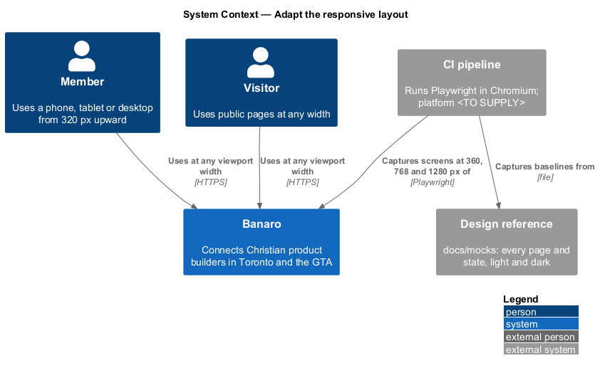
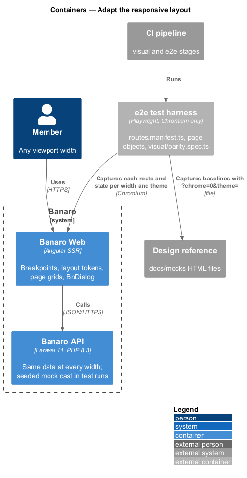
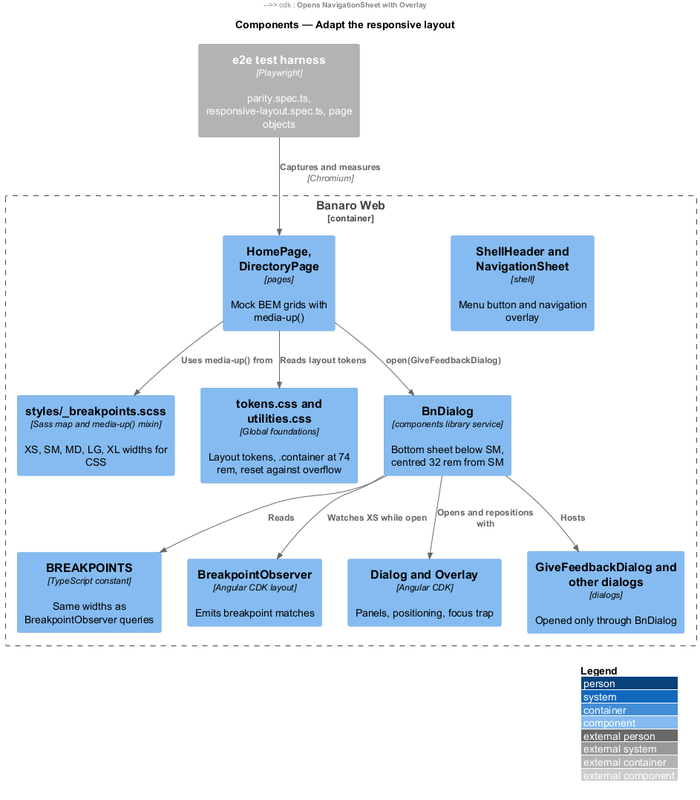
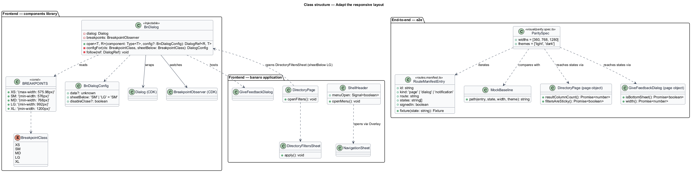
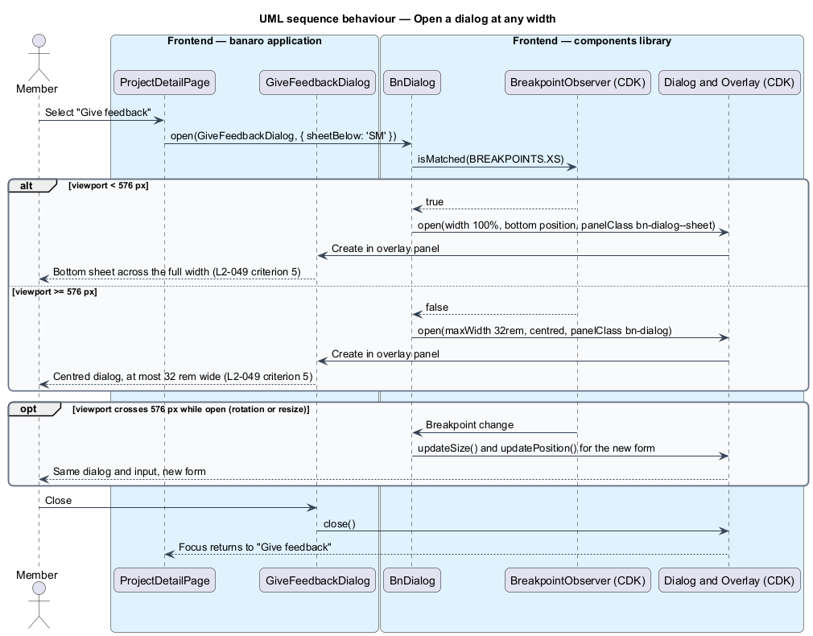
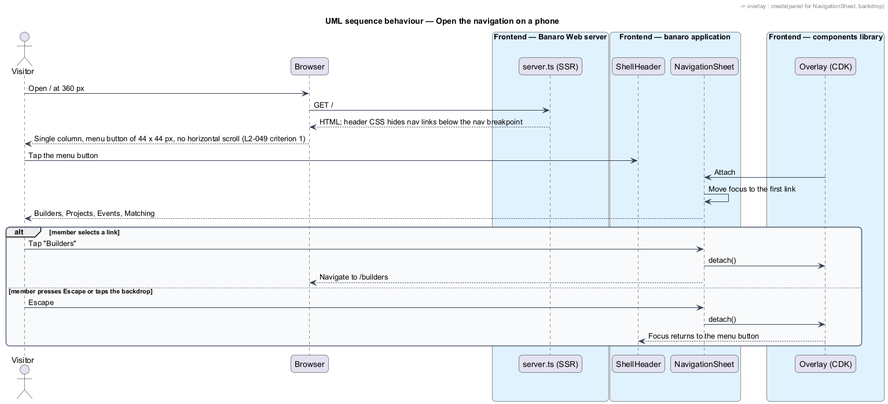
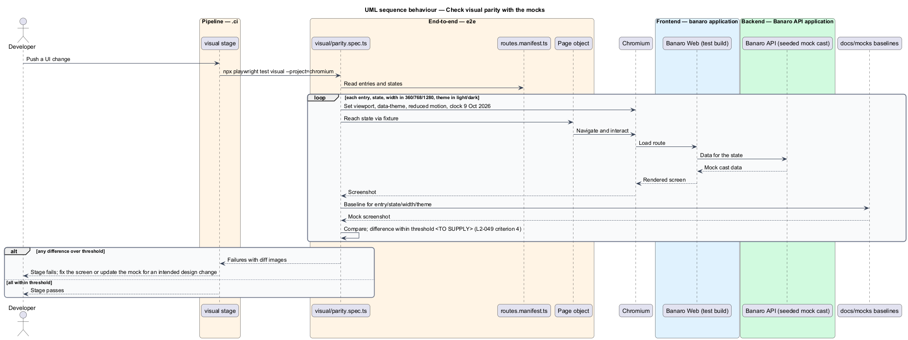

# Adapt the responsive layout

## Overview

Members use Banaro on phones, tablets and desktop screens. Every screen shall work at every width
from 320 px upward and match the design reference in `docs/mocks/` at 360, 768 and 1280 px. This
feature is the mechanism that adapts layouts and dialogs to the viewport and proves visual parity with
the mocks. It belongs to the `user-experience` subsystem. It has no screen of its own; every page,
dialog and shared component in the `banaro` and `admin` applications uses it.

Terms used in this design:

- **viewport** — visible area of the browser window, measured in CSS pixels
- **breakpoint** — viewport width at which a layout rule changes
- **breakpoint class** — named range of viewport widths: XS, SM, MD, LG or XL
- **layout token** — design-system custom property that sets columns, gutters, margins or the content cap, such as `--layout-container-max`
- **bottom sheet** — dialog that spans the viewport width and rises from the bottom edge
- **touch target** — area that responds to a tap
- **visual parity** — agreement between a screenshot of the application and the screenshot of the matching mock, within a pixel-difference threshold
- **route manifest** — `e2e/routes.manifest.ts`, the list of every route in every state, shared by the visual, accessibility and performance checks

The breakpoint classes come from the `L2.md` conventions:

| Class | Width | Layout from `L2-049` |
|-------|-------|----------------------|
| XS | < 576 px | Single column, navigation behind a menu button, 44 × 44 px touch targets, dialogs as bottom sheets |
| SM | ≥ 576 px | Dialogs centred, at most 32 rem wide |
| MD | ≥ 768 px | Home areas, featured builders and directory cards in two columns |
| LG | ≥ 992 px | Directory filters leave the bottom sheet (`L2-010` criterion 6) |
| XL | ≥ 1200 px | Directory filters as a sticky sidebar beside a two-column grid; home builders in three columns; content capped at 74 rem |

## Description

The representative flow is a member opening the `give-feedback` dialog on a 360 px phone.

### Frontend — breakpoints and layout tokens (`components` library)

- **`styles/_breakpoints.scss`** (`components/src/styles/`) — one Sass map of the breakpoint classes
  and a `media-up($class)` mixin. CSS custom properties cannot appear in media queries, so component
  styles use the mixin rather than a token.
- **`BREAKPOINTS`** (`components/src/lib/layout/breakpoints.ts`) — the same widths as CDK
  `BreakpointObserver` queries, such as `XS: '(max-width: 575.98px)'`. The Sass map and this constant
  are the only two places that state the widths.
- **Layout tokens** (`components/src/styles/tokens.css`, copied from `docs/design-system/tokens/`) —
  `--layout-columns`, `--layout-gutter`, `--layout-margin`, `--layout-container-max` (74 rem),
  `--layout-sidebar-width` and `--layout-section-gap`. Pages read these tokens by role, never by
  value.
- **Utilities** (`components/src/styles/utilities.css`) — `.container` caps content at
  `--layout-container-max` and centres it (`L2-049` criterion 3). `.stack` and `.cluster` give vertical
  and wrapping horizontal rhythm. Global styles hold only these foundations and utilities.
- **No horizontal page scroll** — the reset sets `min-inline-size: 0` on grid and flex children,
  `max-inline-size: 100%` on media and `overflow-wrap: anywhere` on user-supplied text, such as an
  unusually long builder name (`L2-049` criterion 1, `L2-010` criterion 7).
- **Touch targets** — interactive components use `--control-height-md` and `--target-comfortable`
  (both 2.75 rem, 44 px) as their minimum block and inline size below SM (`L2-049` criterion 1).

### Frontend — page layouts (`banaro` application)

- **Mock BEM classes** — pages keep the mocks' BEM classes, such as `.people`, `.areas`, `.results` and
  `.dir`. Each page's component styles hold its grid rules with `media-up()`:
  - `HomePage` (`pages/home/`) — areas and featured builders in two columns from MD; builders in three
    columns from XL (`L2-049` criteria 2 and 3).
  - `DirectoryPage` (`pages/directory/`) — result cards in two columns from MD. From XL, `.dir` becomes
    a grid of `--layout-sidebar-width` and the results, and the filter panel is `position: sticky`
    (`L2-049` criteria 2 and 3).
- **`ShellHeader`** (`shell/header/`) — below the navigation breakpoint, the primary navigation sits
  behind the `bn-menu-button`. The button opens `NavigationSheet` through CDK `Overlay`, with focus
  moved into the sheet and returned to the button on close (`L2-049` criterion 1).

### Frontend — responsive dialogs (`components` library)

- **`BnDialog`** (`components/src/lib/dialog/`) — injectable wrapper around CDK `Dialog`. Every
  dialog in both applications opens through `BnDialog.open(component, config)`:
  1. It reads the current breakpoint class from `BreakpointObserver` with `BREAKPOINTS.XS`.
  2. Below SM, it sets `width: '100%'`, a `GlobalPositionStrategy` aligned to the bottom, and the
     panel class `bn-dialog--sheet`. The dialog renders as a bottom sheet (`L2-049` criterion 5).
  3. From SM, it sets `maxWidth: '32rem'`, centres the panel horizontally and vertically, and uses the
     panel class `bn-dialog` (`L2-049` criterion 5).
  4. While the dialog is open, it subscribes to breakpoint changes and calls `updatePosition()` and
     `updateSize()`, so rotating a phone moves the dialog between the two forms.
- **`DirectoryFiltersSheet`** (`pages/directory/filters-sheet/`) — the directory filters below LG
  open through `BnDialog` with `sheetBelow: 'LG'`, so they keep the sheet form below LG, with an "Apply" action (`L2-010`
  criterion 6). It lives with the directory page because the mocks show it in the `directory` page
  files, not as a separate dialog.
- **Dialog styles** — `bn-dialog` and `bn-dialog--sheet` take radius, elevation, backdrop and motion
  from tokens, matching the mocks' `.dialog` and `.backdrop` rules.

### End-to-end — `e2e/`

- **`routes.manifest.ts`** — lists each mock page, dialog and notification with its route, its states,
  whether it needs a signed-in member, and the fixture that puts the application in each state. The
  visual, accessibility and performance checks all read it.
- **`visual/parity.spec.ts`** — for each manifest entry and state, at widths 360, 768 and 1280 px, in
  light and dark themes:
  1. Fixes the clock at Friday 9 October 2026 and loads the mock cast through the fixtures.
  2. Emulates `prefers-reduced-motion: reduce` and waits for fonts, so captures are stable.
  3. Uses the screen's page object to reach the state.
  4. Compares the capture with the baseline taken from the matching mock file opened with
     `?chrome=0&theme=<theme>` at the same width (`L2-049` criterion 4).
- **Baselines** — a script in `e2e/visual/` regenerates mock baselines from `docs/mocks/`. Baselines
  change only for intentional design changes, as `AGENTS.md` requires.
- **`specs/user-experience/responsive-layout.spec.ts`** — acceptance tests for criteria 1, 2, 3 and 5
  through page objects, such as `DirectoryPage.resultColumnCount()`, `ShellPage.hasHorizontalScroll()`,
  `ShellPage.smallestTouchTarget()` and `GiveFeedbackDialog.isBottomSheet()`. They also run at 320 px,
  the narrowest supported width. They carry the acceptance-test header naming `L2-049`.

### Open points

- **Breakpoint conflict.** The `L2.md` conventions set SM, LG and XL at 576, 992 and 1200 px. The
  design-system tokens (`--layout-breakpoint-sm/-lg/-xl`) and the mock CSS use 40, 64 and 80 rem
  (640, 1024 and 1280 px). In the mocks, dialogs centre at 640 px, and the directory sidebar and
  three-column home grid start at 1024 px. `L2-010` criterion 6 sets the filter sidebar at 992 px,
  while `L2-049` criterion 3 places it at 1200 px. The parity widths 360, 768 and 1280 fall in the
  same class under both sets, so visual tests do not expose the difference. This design names the
  classes by the `L2.md` values; the project owner should settle the values in the specifications or
  the design system before implementation. Resolution: `<TO SUPPLY>`.
- **Popover API versus CDK.** The mocks open the mobile menu and the filter sheet with the HTML
  Popover API. `AGENTS.md` requires CDK Dialog or Overlay for modal behaviour. The design uses CDK.
  Visual parity holds because the markup and classes match the mocks.
- Width at which the primary navigation leaves the menu button between 576 px and 1024 px:
  `<TO SUPPLY>`. The mocks show the menu button up to 1024 px.
- Visual-parity threshold (maximum pixel-difference ratio): `<TO SUPPLY>`.
- `docs/mocks` has no admin screens, so the admin application has no parity baselines yet.

## Requirements

| L2 ID | Refines (L1) | Requirement |
|-------|--------------|-------------|
| `L2-049` | `L1-016` | Every screen shall be usable at every viewport width from 320 px upward and shall match the mocks at 360, 768 and 1280 px. |

The design realizes all five acceptance criteria of `L2-049`. The Description cites each criterion
where a component or check enforces it.

## Diagrams

### System context

Members use Banaro on devices of every width. The CI pipeline compares Banaro screens with the mocks
in `docs/mocks/` at three widths in both themes.

### Containers

Banaro Web carries the layout logic; the Banaro API supplies the same data at every width. The
pipeline's Playwright run reads the route manifest and the mock files.

### Components

Inside Banaro Web, pages and dialogs read breakpoints from one Sass map and one TypeScript constant.
`BnDialog` chooses the bottom-sheet or centred form from `BreakpointObserver`.

### Class structure

`BnDialog` wraps CDK `Dialog` and builds a configuration per breakpoint class. In `e2e/`, the parity
spec iterates the manifest and drives page objects.

### Behaviour — open a dialog at any width

A member opens `give-feedback`. Below 576 px it rises as a bottom sheet; from 576 px it is centred at
up to 32 rem. A width change while it is open moves it between the two forms.

### Behaviour — open the navigation on a phone

At a narrow width, the header shows only the menu button. The button opens the navigation sheet and
returns focus when it closes.

### Behaviour — check visual parity with the mocks

The pipeline captures each screen and state at 360, 768 and 1280 px in both themes and compares each
capture with its mock baseline.

