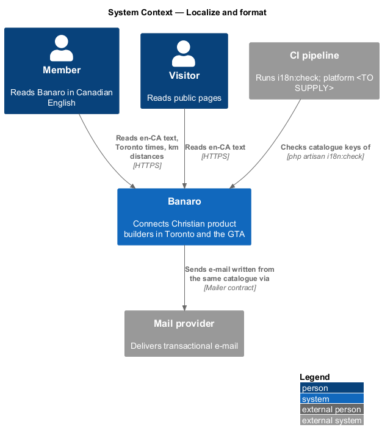
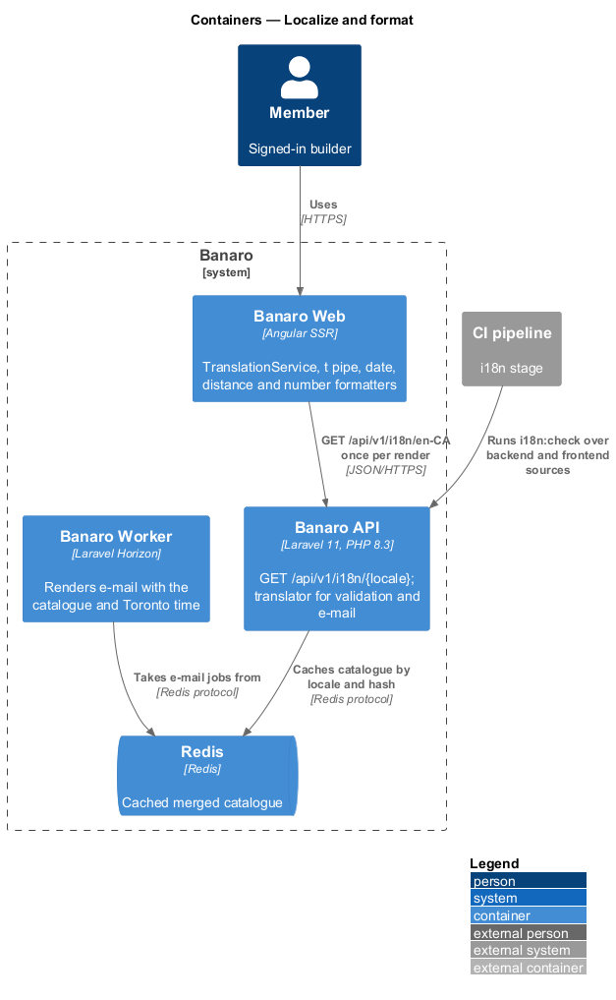
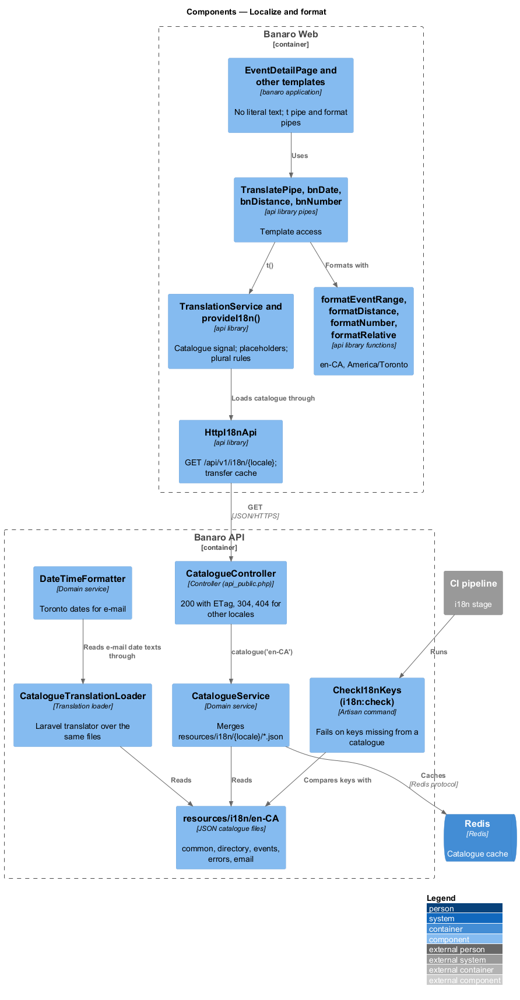
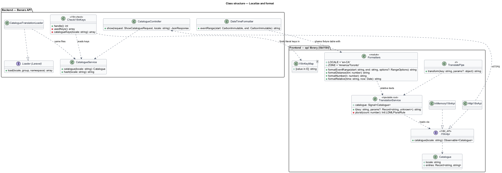
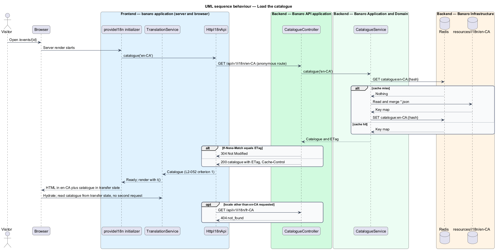
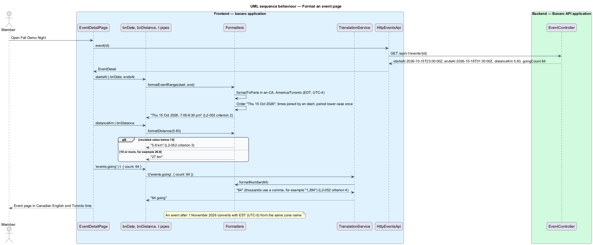
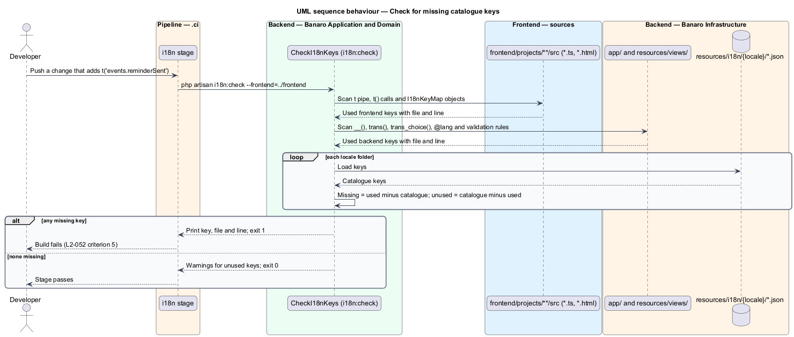

# Localize and format

## Overview

Banaro speaks to a Toronto audience in Canadian English. Event times read in Toronto time, distances
read in kilometres, and every word on screen comes from a translation catalogue so that other locales
can follow. This feature is the mechanism that serves the catalogue, formats dates, times, distances
and numbers, and checks in the pipeline that no key is missing. It belongs to the `user-experience`
subsystem. It has no screen of its own; every page, dialog, toast and e-mail uses it.

Terms used in this design:

- **locale** — language and region tag that selects text and formatting rules; Banaro serves `en-CA`
- **translation catalogue** — set of key–text pairs for one locale, stored in `backend/resources/i18n/{locale}/`
- **translation key** — dotted identifier of one text, such as `directory.resultCount`
- **placeholder** — named slot in a catalogue text, such as `{count}`, filled at render time
- **time zone** — IANA zone `America/Toronto`, Eastern Time with daylight-saving changes
- **daylight-saving change** — clock shift between Eastern Standard Time and Eastern Daylight Time; in 2026 on 8 March and 1 November
- **formatter** — function that turns a value into display text by fixed rules

The rules come from `L2-052`:

| Value | Rule | Example |
|-------|------|---------|
| Text | From the `en-CA` catalogue served at `/api/v1/i18n/en-CA` | "1,284 builders in Toronto and the GTA" |
| Date and time | Canadian English, `America/Toronto`, across daylight-saving changes | "Thu 15 Oct 2026, 7:00–9:30 pm" |
| Distance | Kilometres; one decimal under 10 km, none from 10 km | "5.8 km", "27 km" |
| Number | Comma thousands separator | "1,284" |

## Description

The representative flow is a member opening the event page for Fall Demo Night.

### Backend — catalogue

- **`resources/i18n/en-CA/*.json`** — one JSON file per area, such as `common.json`, `directory.json`,
  `events.json`, `errors.json` and `email.json`. The file name is the first key segment, so
  `events.json` holds `events.*` keys. Texts use `{name}` placeholders and an ICU `plural` subset,
  such as `{count, plural, one {# going} other {# going}}`.
- **`CatalogueService`** (`app/Services/UserExperience/`) — `catalogue(string $locale): Catalogue`
  merges the locale's files into one flat key map. It caches the result in Redis under the locale and
  a content hash, and computes an `ETag` from the hash.
- **`CatalogueController`** (`Controllers/Api/V1/UserExperience/`) — `show()` handles
  `GET /api/v1/i18n/{locale}` and validates it with `ShowCatalogueRequest`. The route is in
  `routes/api_public.php`, because visitors need text too.
  The `{locale}` parameter matches `config('banaro.locales')`, which holds only `en-CA`; any other
  value answers 404. The response carries `ETag` and `Cache-Control: public, max-age=<TO SUPPLY>`.
  A matching `If-None-Match` answers 304 (`L2-052` criterion 1).
- **`CatalogueTranslationLoader`** (`app/Services/UserExperience/`) — implements Laravel's translation
  `Loader` contract over the same files. `AppServiceProvider` registers it, and `config/app.php` sets
  `locale` and `fallback_locale` to `en-CA`. Validation messages, notification e-mail and Blade views
  therefore read the same catalogue as the browser.
- **`DateTimeFormatter`** (`app/Services/UserExperience/`) — PHP twin of the frontend date formatter
  for e-mail, built on Carbon with `America/Toronto`. Both share one fixture table of inputs and
  expected outputs.
- **Storage and transport** — the API stores times in UTC and sends them as ISO 8601 with `Z`. The API
  never formats a date for the browser.

### Backend — `i18n:check`

- **`CheckI18nKeys`** (`app/Console/Commands/`, signature `i18n:check`) — collects every key used in
  code and compares the set with each catalogue in `resources/i18n/` (`L2-052` criterion 5):
  - frontend: `| t:'key'` and `t('key')` with a literal key in `frontend/projects/**/src/**/*.{ts,html}`
  - frontend key maps: `satisfies I18nKeyMap` objects that map enum values to literal keys, such as
    role labels, so computed keys are still found
  - backend: `__('key')`, `trans('key')`, `trans_choice('key')` and `@lang('key')` in `app/` and
    `resources/views/`
  - validation: the message keys of the rules used in form requests
- It prints each missing key with the file and line that uses it and exits 1 when any key is missing.
  Unused catalogue keys are reported as warnings.
- **`.ci/` i18n stage** — runs `php artisan i18n:check --frontend=../frontend` on every pipeline. A
  non-zero exit fails the build.

### Frontend — `api` library (`lib/i18n/`)

- **`I18nApi`** / **`I18N_API`** / **`HttpI18nApi`** — contract, token and HTTP implementation.
  `catalogue(locale)` sends `GET /api/v1/i18n/{locale}`. `InMemoryI18nApi` (`lib/testing/`) serves a
  fixed catalogue for tests.
- **`TranslationService`** — holds the catalogue in a signal. `t(key, params?)` looks up the key,
  fills placeholders and selects plural forms with `Intl.PluralRules('en-CA')`. A missing key renders
  the key itself and logs a warning, so a gap is visible in tests.
- **`provideI18n()`** — registers an app initializer that loads the catalogue before the first render.
  On the server, the request goes to the API, and `withHttpTransferCacheOptions` puts the response into
  the transfer state. The browser reuses it during hydration and does not fetch it again.
- **`TranslatePipe`** (`t`) — pure pipe over `TranslationService.t()` for templates (`L2-052`
  criterion 1).
- **Formatters** — pure functions with fixed locale `en-CA` and zone `America/Toronto`. They use the
  runtime's `Intl` data, which Node includes in full on the server.
  - `formatEventRange(start, end, options)` — assembles weekday, day, short month and year from
    `Intl.DateTimeFormat(...).formatToParts()` in the fixed order "Thu 15 Oct 2026". It joins the times
    with an en dash and writes the day period once in lower case without dots: "7:00–9:30 pm". When the
    two times fall in different periods, each carries its own: "11:00 am–1:00 pm". Because the zone is
    named, an event on either side of 1 November 2026 shows its local wall-clock time (`L2-052`
    criterion 2).
  - `formatDistance(km)` — rounds to one decimal; below 10 it shows one decimal ("5.8 km"), from 10 it
    shows a whole number ("27 km", from 26.9) (`L2-052` criterion 3).
  - `formatNumber(n)` — `Intl.NumberFormat('en-CA')`, which groups thousands with a comma ("1,284")
    (`L2-052` criterion 4).
  - `formatRelative(time, now)` — "1 h ago", "Yesterday" and similar texts for last-seen status, with
    the texts from the catalogue.
- **Pipes** — `bnDate`, `bnDistance` and `bnNumber` wrap the formatters for templates.

### Frontend — `banaro` and `admin` applications

- **`app.config.ts`** — binds `I18N_API` to `HttpI18nApi` and calls `provideI18n('en-CA')`.
- **`index.html`** — sets `<html lang="en-CA">`.
- **Templates** — contain no literal user-facing text. Every string comes through `t`, and every date,
  distance and number through the pipes. `EventDetailPage` (`pages/event-detail/`) shows
  `{{ event.startsAt | bnDate: event.endsAt }}`, `{{ event.distanceKm | bnDistance }}` and
  `{{ 'events.going' | t: { count: event.goingCount } }}`.

### Tests

- `e2e/specs/user-experience/localize-and-format.spec.ts` — loads the event page and the directory
  with the mock cast and checks "Thu 15 Oct 2026, 7:00–9:30 pm", "5.8 km", "27 km" and "1,284" through
  page objects. It also opens an event dated after 1 November 2026 with the browser's zone set to a
  different zone, and checks the Toronto wall-clock time. It carries the acceptance-test header naming
  `L2-052`.
- `backend/tests/Feature/UserExperience/CatalogueTest.php` — asserts that `GET /api/v1/i18n/en-CA`
  answers 200 without a session, that `ETag` revalidation answers 304, and that an unsupported locale
  answers 404.

### Open points

- **French in the settings mock.** `docs/mocks/pages/settings/default.html` shows a Language control
  with "English" and "Français". `L2-052` and `L1-017` require only `en-CA`, and no requirement covers
  choosing a language. The design serves `en-CA` only. Whether to add `fr-CA` and a language setting,
  or to remove the control from the mock, is `<TO SUPPLY>`.
- **Year in short dates.** The events list mock shows "Sat 17 Oct, 8:00–9:30 am" without a year,
  while `L2-052` criterion 2 gives "Thu 15 Oct 2026, 7:00–9:30 pm". The rule for leaving out the year
  (for example, for dates in the current year) is `<TO SUPPLY>`.
- **Catalogue unavailable.** When the catalogue cannot load, the application cannot render any text,
  including the `server-error` page. A minimal fallback for the error page is `<TO SUPPLY>`.
- Browser cache lifetime of the catalogue: `<TO SUPPLY>`.

## Requirements

| L2 ID | Refines (L1) | Requirement |
|-------|--------------|-------------|
| `L2-052` | `L1-017` | Text, dates, times and distances shall be formatted for Toronto and served from translation catalogues. |

The design realizes all five acceptance criteria of `L2-052`. The Description cites each criterion
where a component or check enforces it.

## Diagrams

### System context

Members and visitors read Banaro in Canadian English with Toronto time. The CI pipeline runs
`i18n:check` against the catalogues before a build may proceed.

### Containers

Banaro Web loads the catalogue from the Banaro API once per render and formats values itself. The API
caches the merged catalogue in Redis.

### Components

The `api` library's `TranslationService`, pipe and formatters serve every template. On the backend,
`CatalogueService` feeds both the catalogue endpoint and Laravel's translator.

### Class structure

`HttpI18nApi` implements the `I18nApi` contract. `CatalogueTranslationLoader` implements Laravel's
`Loader` over the same files that `CatalogueService` serves.

### Behaviour — load the catalogue

The server loads the catalogue before the first render and hands it to the browser in the transfer
state. Revalidation with `ETag` avoids sending an unchanged catalogue again.

### Behaviour — format an event page

The event page renders its date range, distance and going count through the formatters and the
catalogue.

### Behaviour — check for missing keys

The pipeline runs `i18n:check`. A key used in code but missing from a catalogue fails the build.

