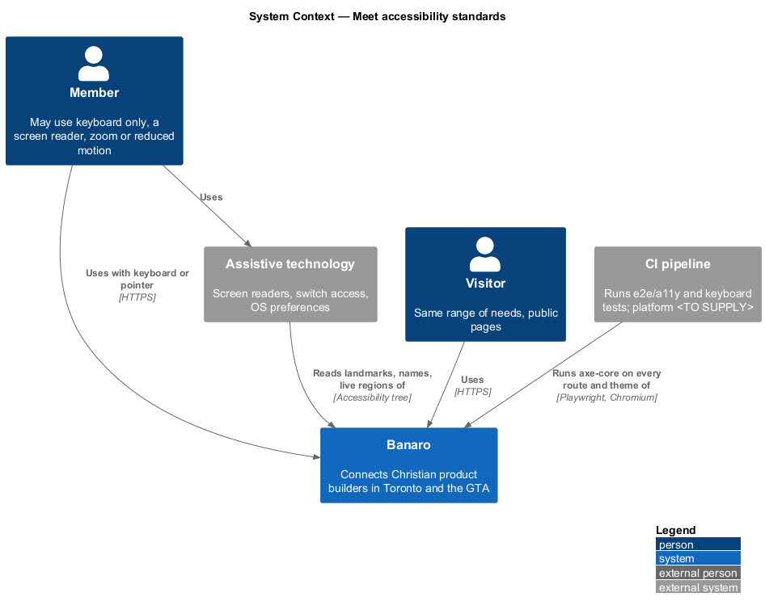
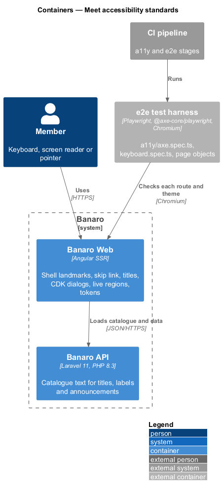
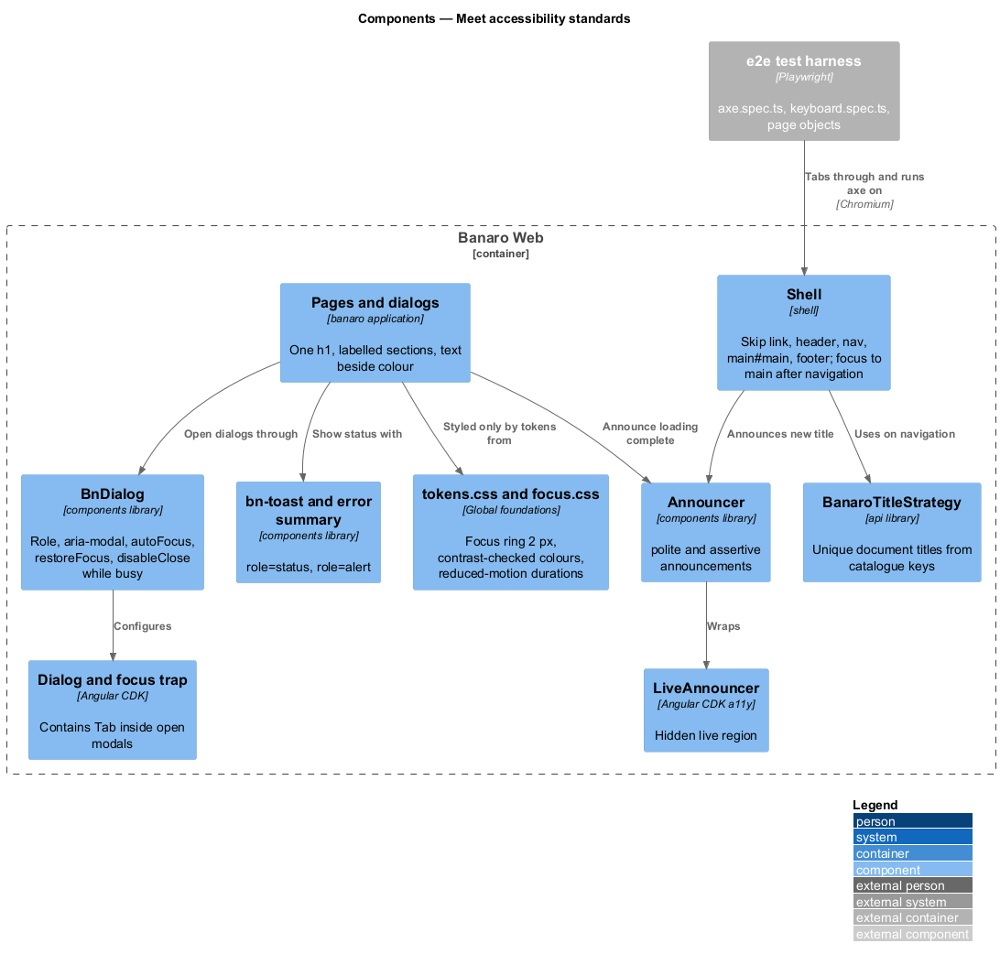
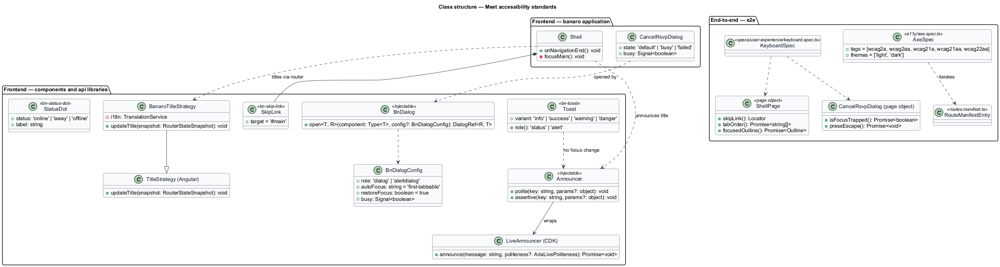
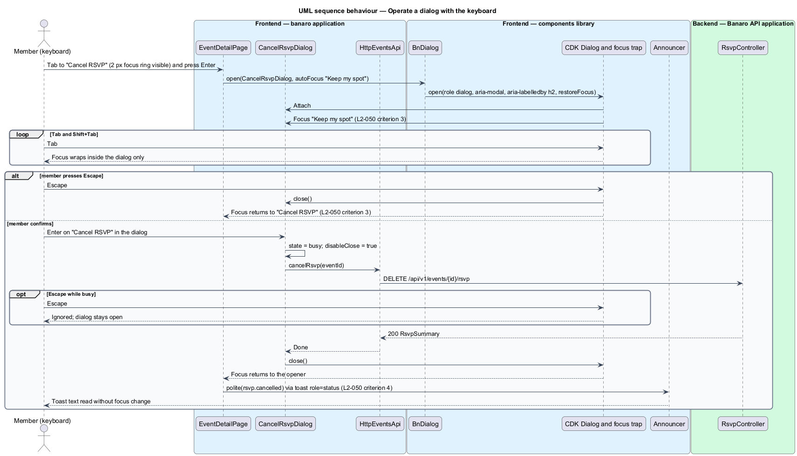
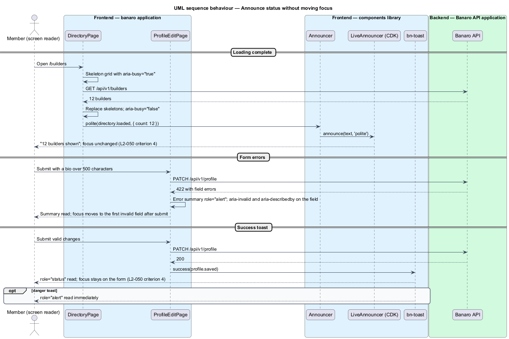
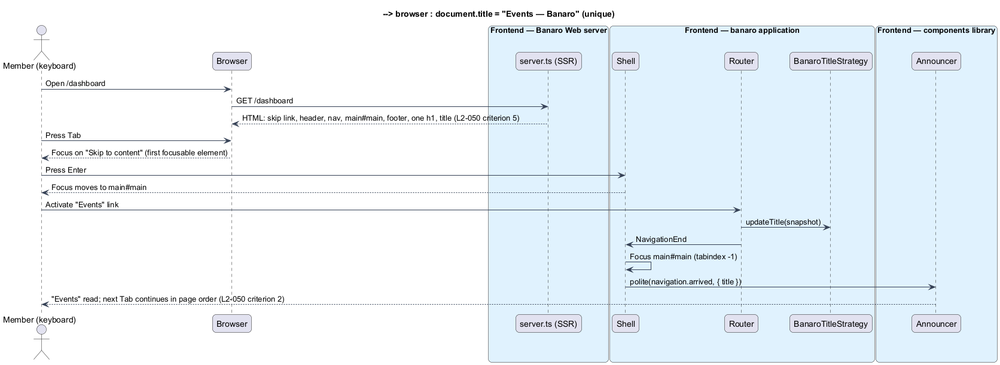
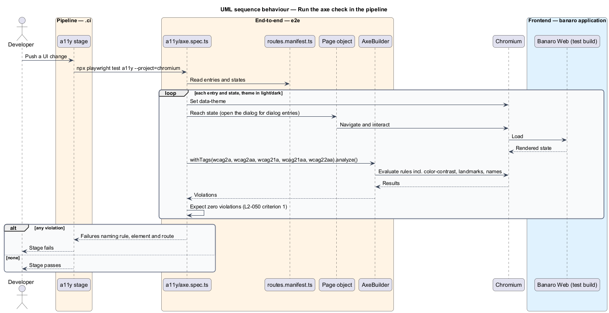

# Meet accessibility standards

## Overview

Banaro serves every builder in the GTA, including people who use a keyboard only, a screen reader,
high zoom or reduced motion. This feature is the mechanism that makes every Banaro screen meet the Web
Content Accessibility Guidelines (WCAG) 2.2 at level AA, and that proves it on every route in both
themes. It belongs to the `user-experience` subsystem. It has no screen of its own; the shell, the
shared components, every dialog and every page use it.

Terms used in this design:

- **WCAG 2.2 AA** — level AA of the W3C Web Content Accessibility Guidelines, version 2.2
- **axe-core** — open-source engine that checks a rendered page against WCAG rules
- **focus ring** — visible outline around the element that has keyboard focus
- **focus trap** — rule that keeps Tab and Shift+Tab inside one region, such as an open modal dialog
- **live region** — element whose content changes are read out by assistive technology without moving focus
- **landmark** — region with a structural role, such as `header`, `nav`, `main` or `footer`, that screen-reader users jump between
- **skip link** — link at the start of the page that moves focus past the header to the main content
- **reduced motion** — user preference, exposed as `prefers-reduced-motion: reduce`, to avoid non-essential animation

The mechanism has four layers. Design-system tokens give focus rings, contrast and motion that already
meet the criteria in both themes. Shared components carry the semantics: the shell's landmarks and skip
link, CDK dialogs with focus management, and an announcer for live regions. Pages follow fixed rules for
headings, titles and status text. The `e2e/a11y` suite runs axe-core on every route and theme, and
keyboard acceptance tests cover what axe cannot see.

## Description

The representative flow is a member cancelling an RSVP with the keyboard only, from the event page
through the `cancel-rsvp` dialog to the success toast.

### Frontend — tokens and global styles (`components` library)

- **Focus ring** — `styles/focus.css` sets `:focus-visible { outline: var(--focus-ring-width) solid
  var(--color-focus-ring); outline-offset: var(--focus-ring-offset); }` for every interactive
  element. The tokens give a 2 px sage ring with a 3 px offset. `--color-focus-ring` is sage 700 in
  light and sage 300 in dark, each at least 3:1 against the canvas and surface (`L2-050`
  criterion 2). Under `forced-colors: active` the ring uses `Highlight`.
- **Contrast** — components take colour only from semantic tokens. The pairs in
  `docs/design-system/tokens/contrast-pairs.json` pass 4.5:1 for text and 3:1 for UI components in
  both themes (`L2-050` criterion 6). `prefers-contrast: more` strengthens borders and muted text.
- **Reduced motion** — `tokens.css` sets every duration token to 0.01 ms and `--lift` to 0 under
  `prefers-reduced-motion: reduce`. Components animate only through these tokens. The scroll drift and
  the breathing online dot run only inside `@media (prefers-reduced-motion: no-preference)`
  (`L2-050` criterion 8).
- **`.visually-hidden`** utility — hides a label visually while keeping it for assistive technology,
  as the directory search label does.

### Frontend — shell (`banaro` and `admin` applications)

- **`Shell`** (`shell/`) — renders, in order, the `bn-skip-link` ("Skip to content", the first
  focusable element), `header` with `nav`, `main id="main" tabindex="-1"`, and `footer` (`L2-050`
  criterion 5). The mocks use the same order and classes.
- **`BanaroTitleStrategy`** (`api` library, `lib/i18n/`) — extends Angular's `TitleStrategy`. It reads
  each route's `title` catalogue key and sets "{page title} — Banaro", or "{page title} · {state} —
  Banaro" where a state changes the page's purpose. Each title is unique (`L2-050` criterion 5).
- **Route focus** — after each in-app navigation, `Shell` moves focus to `main` and announces the new
  title through `Announcer`. The first server-rendered load keeps the browser's default focus.
- **`<html lang="en-CA">`** — set by the `localize-and-format` feature, so screen readers pick the
  right voice.

### Frontend — dialogs and overlays (`components` library)

- **`BnDialog`** — every dialog opens through CDK `Dialog` via `BnDialog` (described in
  `adapt-responsive-layout`). Its configuration gives (`L2-050` criterion 3):
  - `role: 'dialog'` or `'alertdialog'`, `ariaModal: true` and `ariaLabelledBy` set to the dialog's
    `h2`
  - `autoFocus` set to the element the mock names, such as "Keep my spot" in `cancel-rsvp`, otherwise
    `'first-tabbable'`
  - CDK's built-in focus trap, which contains Tab while the dialog is open
  - `restoreFocus: true`, which returns focus to the control that opened the dialog
  - `disableClose` bound to the dialog's busy state, so Escape and backdrop clicks close it except while
    busy
- **Non-modal overlays** — the account menu is not modal. It opens through CDK `Overlay` and
  `CdkMenu`, uses arrow keys, closes on Escape and outside click, and does not trap focus, as its mock
  states.
- **No other traps** — no component other than an open modal dialog contains focus (`L2-050`
  criterion 2).

### Frontend — live regions and status (`components` library)

- **`Announcer`** (`components/src/lib/a11y/`) — wraps CDK `LiveAnnouncer`. `polite(key, params)`
  announces status, and `assertive(key, params)` announces failures. Text comes from the translation
  catalogue (`L2-050` criterion 4).
- **Toasts** — `bn-toast` uses `role="status"`, and the danger variant uses `role="alert"`, as
  `L2-028` criterion 1 states. A toast never takes focus.
- **Form errors** — on submit, a form with errors shows an error summary with `role="alert"` and moves
  focus to the first invalid field (`L2-001` criterion 2). Each field links its message through
  `aria-describedby` and sets `aria-invalid`. Errors that appear while typing are not announced.
- **Loading complete** — list pages call `Announcer.polite('directory.loaded', { count })` when
  results replace skeletons. Skeleton containers carry `aria-busy="true"` until then.

### Frontend — content rules for pages and components

- **One `h1` per page**, and sections labelled by their `h2`, as in the mocks (`L2-050` criterion 5).
- **Status never by colour alone** — `bn-status-dot` always renders its word ("Online now"), match
  scores show the percentage, and error fields show an icon and text (`L2-050` criterion 7).
- **Toggle semantics** — skill filters are buttons with `aria-pressed`, and filter groups are
  `fieldset` with `legend` (`L2-010` criterion 5).
- **Touch targets** — at least 24 × 24 px everywhere (`--target-min`, WCAG 2.5.8) and 44 × 44 px below
  576 px (`L2-049` criterion 1).

### End-to-end — `e2e/a11y` and keyboard tests

- **`a11y/axe.spec.ts`** — for each entry and state in `routes.manifest.ts`, in light and dark themes,
  runs `AxeBuilder` from `@axe-core/playwright` with the tags `wcag2a`, `wcag2aa`, `wcag21a`,
  `wcag21aa` and `wcag22aa`. It asserts zero violations (`L2-050` criterion 1). Dialog entries run with
  the dialog open, so the rules see the dialog markup.
- **`specs/user-experience/keyboard.spec.ts`** — acceptance tests through page objects:
  - Tab through each page: every interactive element is reached in DOM order, the first stop is the
    skip link, and each focused element's outline is 2 px with at least 3:1 contrast against its
    background (`L2-050` criteria 2 and 5).
  - Open, tab around, press Escape and check returned focus for each dialog, including Escape while
    busy (`L2-050` criterion 3).
  - Check that each toast and error summary sits in a live region and that focus stays put (`L2-050`
    criterion 4).
  - With `reducedMotion: 'reduce'`, check that computed transition durations are effectively 0
    (`L2-050` criterion 8).
- **Page objects** — `e2e/pages/` own every selector, including `ShellPage.skipLink()`,
  `ShellPage.focusedOutline()` and `CancelRsvpDialog.isFocusTrapped()`. Tests state intent only.
- Each spec carries the acceptance-test header naming `L2-050`.

### Open points

- The mocks do not state where focus goes after an in-app navigation. Moving focus to `main` is a
  design choice that the project owner should confirm: `<TO SUPPLY>`.
- Whether axe also runs on every state of every dialog or on the `default` state only: `<TO SUPPLY>`.
- Manual screen-reader test cadence and the screen readers covered: `<TO SUPPLY>`.
- The admin application has no mocks yet, so its routes are not in `routes.manifest.ts`.

## Requirements

| L2 ID | Refines (L1) | Requirement |
|-------|--------------|-------------|
| `L2-050` | `L1-016` | All screens shall meet WCAG 2.2 level AA. |

The design realizes all eight acceptance criteria of `L2-050`. The Description cites each criterion
where a token, component or test enforces it.

## Diagrams

### System context

Members and visitors use Banaro with a keyboard, a screen reader or a pointer. The CI pipeline runs
axe-core and the keyboard tests on every route in both themes.

### Containers

Banaro Web carries every accessibility mechanism; the Banaro API supplies catalogue text for titles
and announcements. The e2e harness drives Banaro Web in Chromium.

### Components

Inside Banaro Web, the shell provides landmarks, the skip link and titles. `BnDialog` and `Announcer`
wrap the CDK's dialog, focus and live-region parts. Global styles hold the focus, contrast and motion
rules.

### Class structure

`BanaroTitleStrategy` extends Angular's `TitleStrategy`. `Announcer` wraps `LiveAnnouncer`, and
`BnDialog` wraps CDK `Dialog`. The a11y spec iterates the route manifest.

### Behaviour — operate a dialog with the keyboard

The member opens `cancel-rsvp` from the keyboard. Focus moves into the dialog, Tab stays inside, Escape
is ignored while busy, and focus returns to the opener.

### Behaviour — announce status without moving focus

Toasts, error summaries and loading completion reach assistive technology through live regions.
Focus moves only to the first invalid field after a submit.

### Behaviour — navigate between pages

The skip link is the first stop. After an in-app navigation, the title changes, focus moves to `main`,
and the new title is announced.

### Behaviour — run the axe check in the pipeline

The pipeline runs axe-core on every manifest route and state in both themes. Any WCAG 2.2 A or AA
violation fails the stage.

