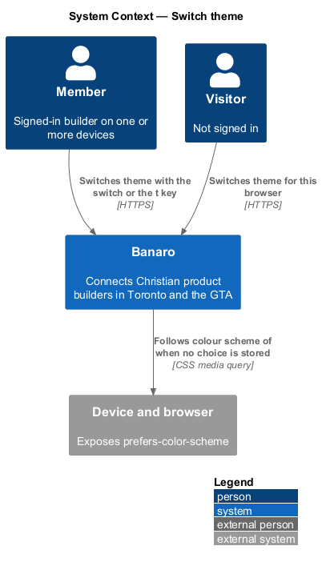
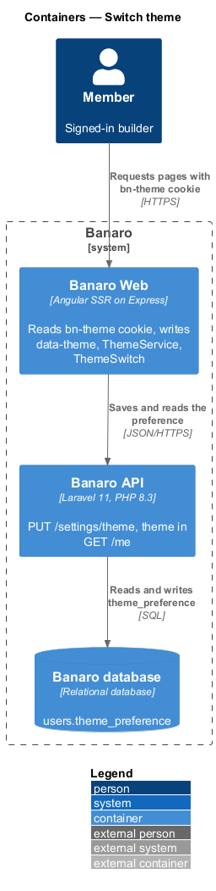
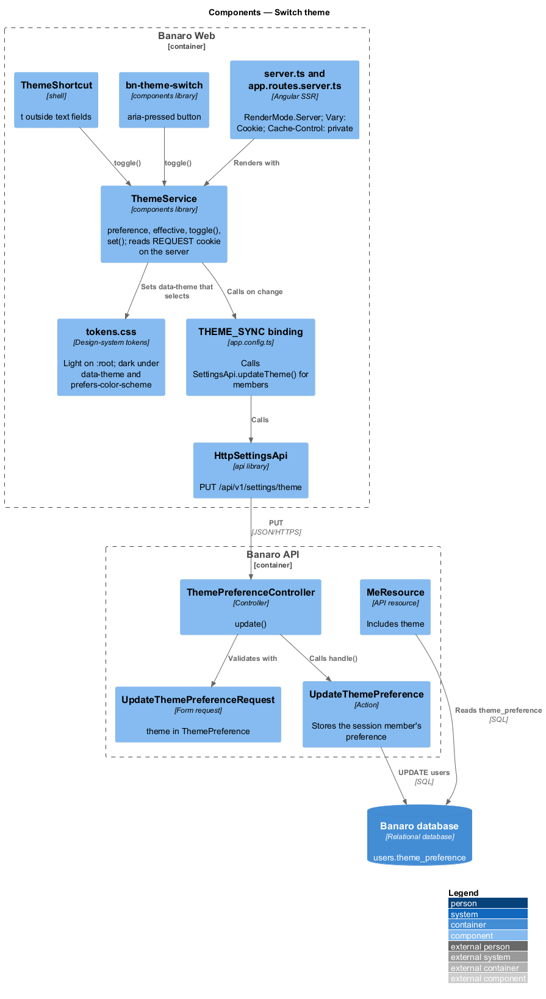
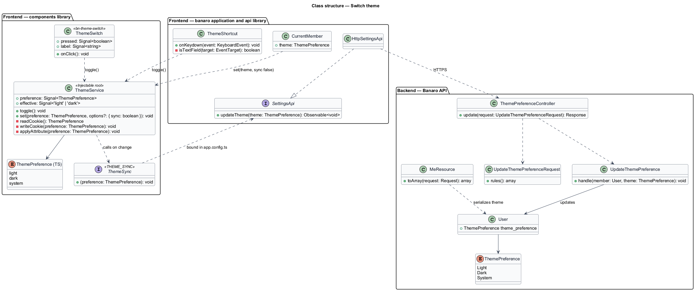
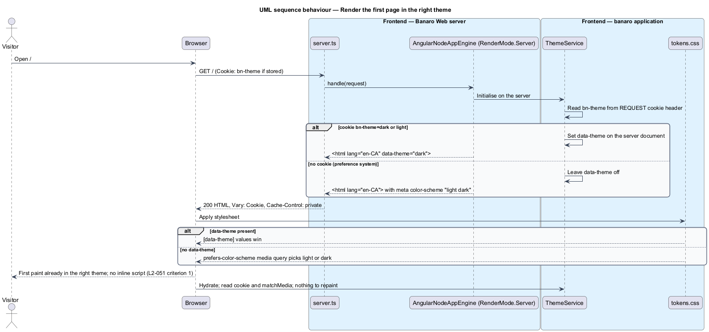
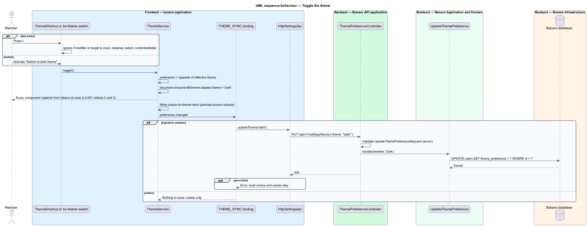
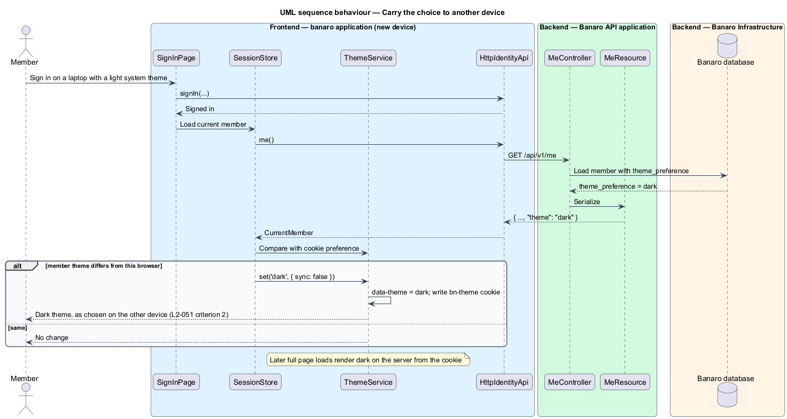

# Switch theme

## Overview

Banaro has a light theme, a birch-paper morning, and a dark theme, a winter evening by lamplight. A
member who has never chosen sees the theme that matches their device. A member who chooses keeps that
choice on every reload and, once signed in, on every device. This feature is the mechanism that
selects, applies and stores the theme. It belongs to the `user-experience` subsystem. It touches the
shell, the server renderer, the design-system tokens and one settings endpoint; every component
inherits it through tokens.

Terms used in this design:

- **theme** — set of semantic colour token values, either light or dark
- **theme preference** — stored choice of `light`, `dark` or `system`; `system` means no explicit choice
- **effective theme** — theme the page shows: the preference, or the device's `prefers-color-scheme` value when the preference is `system`
- **`data-theme`** — attribute on the `<html>` element that pins the effective theme to `light` or `dark`
- **theme cookie** — `bn-theme` cookie that holds the browser's preference so the server can render it
- **flash of the wrong theme** — brief paint in one theme before script switches the page to the other

The design rests on the design-system tokens. `tokens.css` defines light values on `:root`, dark
values under `[data-theme="dark"]`, and the same dark values under `@media (prefers-color-scheme:
dark)` for `:root:not([data-theme="light"])`. A page with no `data-theme` therefore follows the device
with CSS alone. A page with `data-theme` shows that theme. The server writes `data-theme` from the
theme cookie, so the first paint is already right, and no inline script is needed. Inline script would
break the Content Security Policy of `L2-045` criterion 3.

## Description

The representative flow is a signed-in member pressing `t` on the directory and later opening Banaro
on another device.

### Frontend — `components` library

- **`ThemeService`** (`components/src/lib/theme/`) — root service that owns the preference.
  - `preference` signal (`'light' | 'dark' | 'system'`) and `effective` computed signal. `effective`
    reads `matchMedia('(prefers-color-scheme: dark)')` when the preference is `system`, and listens for
    changes.
  - `toggle()` — sets the preference to the opposite of the effective theme.
  - `set(preference)` — writes `data-theme` on `document.documentElement` (or removes it for `system`),
    writes the theme cookie, and calls the `THEME_SYNC` callback. The tokens then repaint every
    component at once (`L2-051` criteria 2 and 3).
  - On the server, `ThemeService` reads the theme cookie from Angular's `REQUEST` token and sets
    `data-theme` on the server document. The rendered HTML therefore carries the attribute (`L2-051`
    criterion 1).
- **Theme cookie** — `bn-theme=light|dark`, `Path=/`, `SameSite=Lax`, `Secure`, lifetime
  `<TO SUPPLY>`. It is absent for `system`. It is not `HttpOnly`, because the browser writes it on
  toggle. It holds no personal data.
- **`ThemeSwitch`** (`bn-theme-switch`, `components/src/lib/theme-switch/`) — button with
  `aria-pressed` and a label from the catalogue ("Switch to dark theme" or "Switch to light theme").
  It calls `ThemeService.toggle()`.
- **`THEME_SYNC`** — injection token for a `(preference) => void` callback. Each application binds it
  in `app.config.ts`. The `components` library therefore needs no dependency on the `api` library.

### Frontend — `banaro` and `admin` applications

- **`ThemeShortcut`** (`shell/theme-shortcut.ts`) — host listener on `document` `keydown`. It calls
  `ThemeService.toggle()` when the key is `t` without modifiers and the event target is not an
  `input`, `textarea`, `select` or `contenteditable` element (`L2-051` criterion 2).
- **Shell placement** — `ShellHeader` and the account menu render `bn-theme-switch`. Its exact place
  follows the mock once one exists (see Open points).
- **`app.config.ts`** — binds `THEME_SYNC` to a function that calls `SettingsApi.updateTheme()` when a
  member is signed in and does nothing for a visitor.
- **Sign-in reconciliation** — after sign-in, and at start-up for a signed-in member, `SessionStore`
  (`api` library, `lib/auth/`) reads `theme` from `GET /api/v1/me`. When it differs from the cookie, it calls `ThemeService.set()`
  without syncing back. The stored choice therefore follows the member across devices (`L2-051`
  criterion 2).
- **`index.html`** — carries `<meta name="color-scheme" content="light dark">`, so the browser's own
  controls and scrollbars match before any style loads.

### Frontend — Banaro Web server

- **Per-request rendering** — `app.routes.server.ts` renders routes with `RenderMode.Server` instead
  of the scaffold's `RenderMode.Prerender`, because a prerendered file cannot reflect the cookie.
- **Caching** — `server.ts` sends `Vary: Cookie` and `Cache-Control: private` on HTML responses, so
  no shared cache serves one member's theme to another.

### Backend — Banaro API

- **`ThemePreference`** (`app/Enums/`) — `Light`, `Dark` and `System`.
- **`users.theme_preference`** — column with default `system`, added by an expand-only migration
  (`L2-054` criterion 2).
- **`ThemePreferenceController`** (`Controllers/Api/V1/Settings/`) — `update()` handles
  `PUT /api/v1/settings/theme` in `routes/api.php`.
- **`UpdateThemePreferenceRequest`** (`Requests/Settings/`) — requires `theme` in
  `Rule::enum(ThemePreference::class)`.
- **`UpdateThemePreference`** (`Actions/Settings/`) — stores the preference for the session member
  only.
- **`MeResource`** (`Resources/Identity/`) — includes `theme` in the current-member payload that
  `MeController` (`Controllers/Api/V1/Identity/`) returns for `GET /api/v1/me`.

### Frontend — tokens-only colour

- Components take every colour from semantic tokens, such as `var(--color-fg-default)` and
  `var(--color-accent)`, never hex values. The dark theme therefore needs no component code (`L2-051`
  criterion 3).
- The visual-parity suite captures every screen in both themes (`L2-049` criterion 4), and axe checks
  contrast in both themes (`L2-050` criterion 1). A hard-coded colour shows up as a parity or contrast
  failure in the dark run.
- Lint enforcement of token-only colours (for example a Stylelint rule) is `<TO SUPPLY>`; no style
  linter is in the workspace yet.

### Acceptance tests

`e2e/specs/user-experience/switch-theme.spec.ts` covers the three criteria through page objects. It
emulates `colorScheme: 'dark'` with no cookie and asserts the server HTML has no `data-theme` and the
first paint is dark. It presses `t` outside a field, reloads, signs in on a new browser context and
checks the theme. It carries the acceptance-test header naming `L2-051`.

### Open points

- **No product theme switch in the mocks.** The only toggle in `docs/mocks` is the mock bar's
  `data-theme-toggle`, which is review chrome. `AGENTS.md` places a theme switch in `shell/`, and
  `L2-051` criterion 2 requires one. The mock state, placement and copy of `bn-theme-switch` are
  `<TO SUPPLY>`.
- Whether the switch offers `system` as a third choice or only toggles light and dark: `<TO SUPPLY>`.
- Whether to tell the member when the preference fails to save to the API: `<TO SUPPLY>`. The design
  keeps the local choice and retries on the next change.
- Theme cookie lifetime: `<TO SUPPLY>`.
- Whether `t` also works while a dialog is open: `<TO SUPPLY>`.

## Requirements

| L2 ID | Refines (L1) | Requirement |
|-------|--------------|-------------|
| `L2-051` | `L1-016` | The app shall offer light and dark themes that follow the system by default. |

The design realizes all three acceptance criteria of `L2-051`. The Description cites each criterion
where a component enforces it.

## Diagrams

### System context

A member's device states a colour-scheme preference. Banaro follows it until the member chooses, and
then stores the choice for every device.

### Containers

Banaro Web renders the theme from the cookie and applies changes in the browser. The Banaro API stores
the member's preference in the Banaro database.

### Components

`ThemeService` reads the cookie on the server and the media query in the browser. `ThemeSwitch` and
`ThemeShortcut` call it, and `THEME_SYNC` sends the choice to `ThemePreferenceController`.

### Class structure

`ThemeService` owns the preference and depends on the `THEME_SYNC` callback rather than on the `api`
library. The backend stores a `ThemePreference` enum on the user.

### Behaviour — render the first page in the right theme

The server reads the theme cookie. With a stored choice it writes `data-theme`; without one it leaves
the attribute off and the CSS media query follows the device.

### Behaviour — toggle the theme

The member presses `t` or uses the switch. The page repaints at once, the cookie updates, and a
signed-in member's choice is saved through the API.

### Behaviour — carry the choice to another device

The member signs in on a new device. The current-member payload carries the stored theme, and the
application applies it and writes the cookie.

